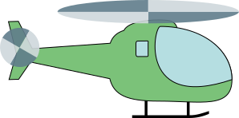
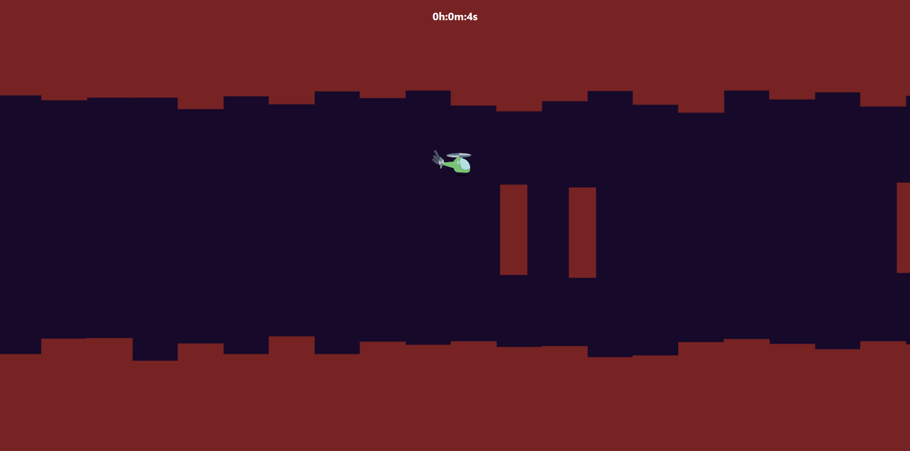

# Heli-Hop

Heli-Hop is a simple helicopter game for web that utilizes matter.js library. This game is playable on both PC and mobile devices.

## Info
Most of the graphics are procedurally generated using matter.js. I drew the helicopter graphics myself. The included audios collected from public domain sources.

## How to play?
Simply go to [irfancmd.github.io/Heli-Hop](https://irfancmd.github.io/Heli-Hop) for launching the game. For PC, press either left or right mouse buttons for making the helicopter hop. For mobile devices, simply tap anywhere on the game screen.

